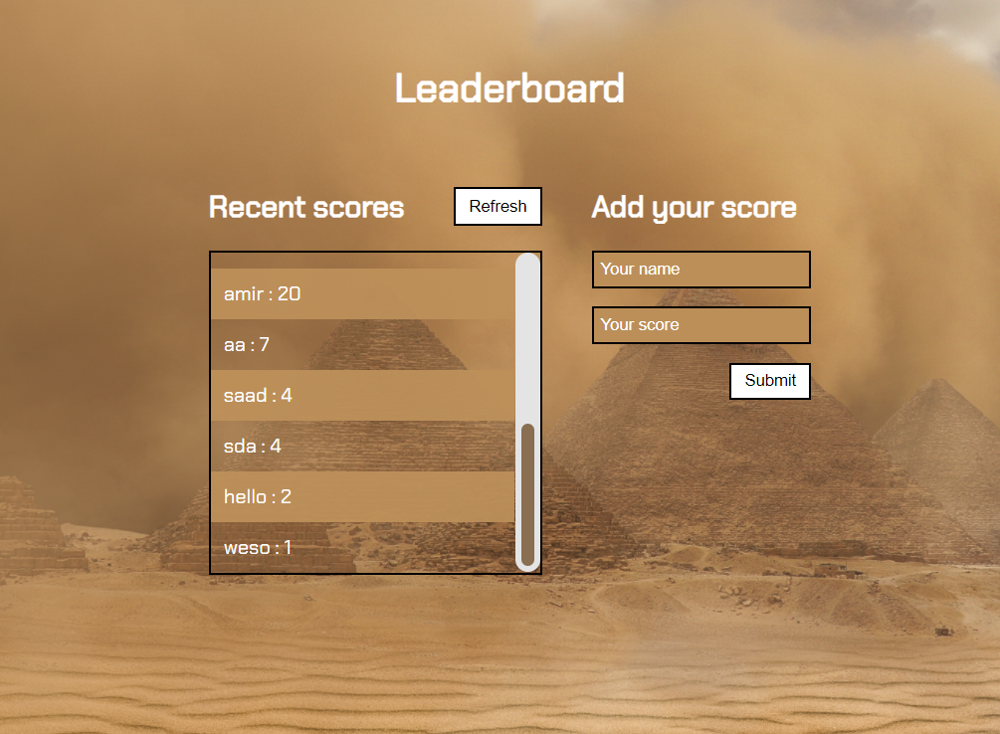

# Scores Leadboard

This is a leaderboard app to displays scores submitted by different players, It is used API to get data and post new score.



## Built using

- HTML
- CSS
- JavaScript
- Webpack


## Getting Started

after cloning
```
git clone https://github.com/omarsalem7/My-leaderboard.git
cd My-leaderboard

```
After That
```
npm install
npm start
```


## Authors

👤 **Omar Salem**

- GitHub: [Omar Salem](https://github.com/omarsalem7)
- Twitter: [Omar Salem](https://twitter.com/Omar80491499)
- LinkedIn: [Omar Salem](https://www.linkedin.com/in/omar-salem-a6945b177/)


## Show your support

Give a ⭐️ if you like this project!

